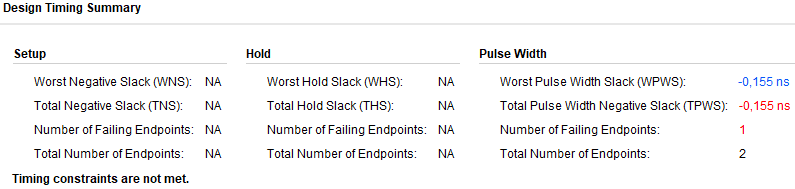
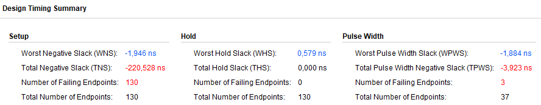
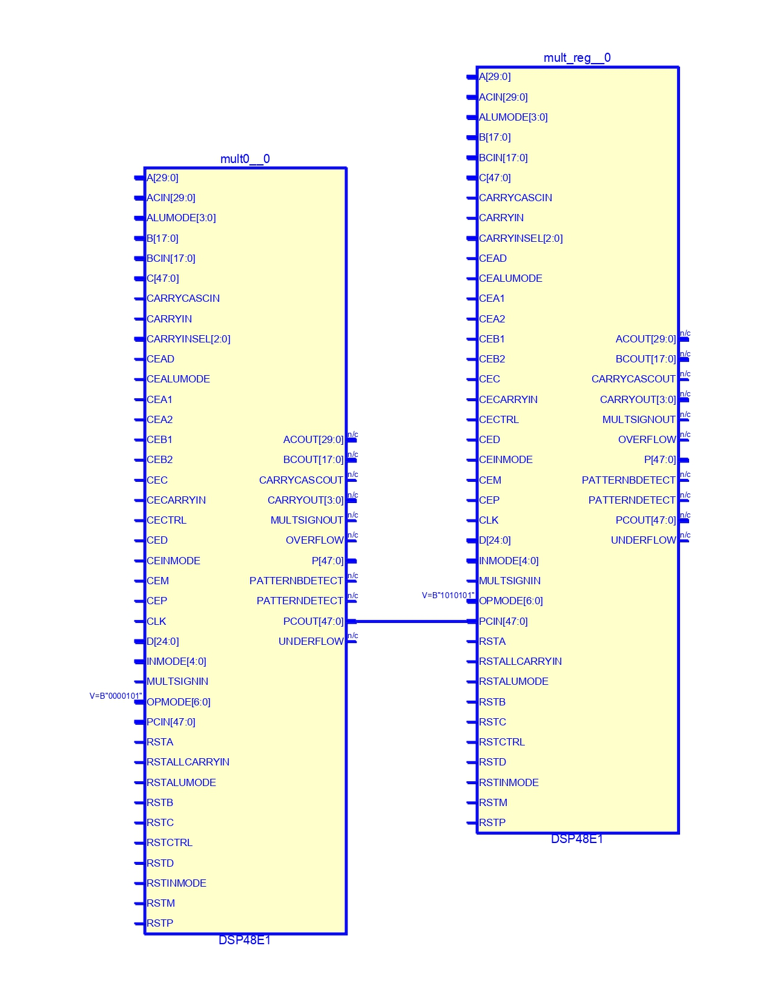
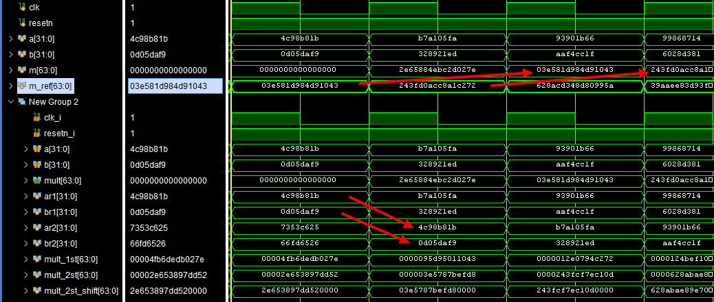
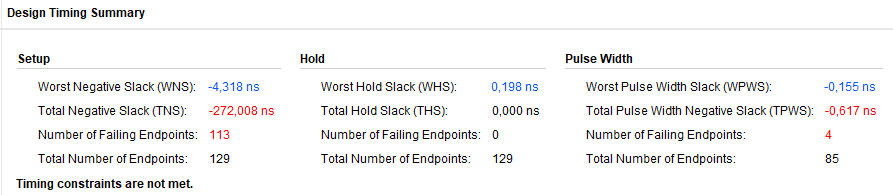
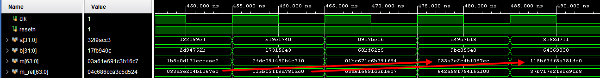
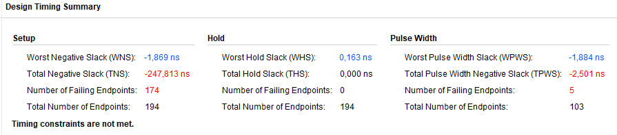
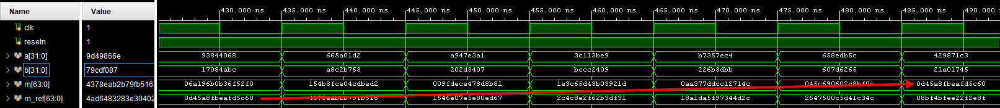
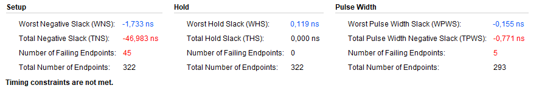
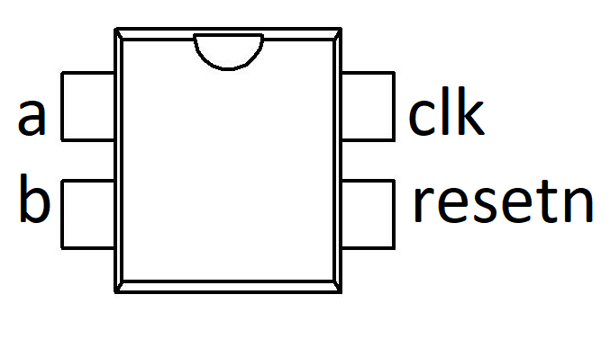

# Конвейеризация

Конвейеризация на (ПЛИС) - это процесс организации выполнения задачи или алгоритма на ПЛИС с использованием конвейерной архитектуры. Конвейерная архитектура представляет собой разделение задачи на несколько последовательных этапов, которые выполняются параллельно. Каждый этап обрабатывает часть данных до передачи его следующему этапу. Таким образом, задача разделяется на несколько более простых этапов, что позволяет увеличить производительность схемы.

Теоритические преимущества использования конвейерного алгоритма на ПЛИС:

1. Увеличение скорости выполнения задачи: конвейерная архитектура позволяет распараллелить выполнение задачи на несколько этапов, что приводит к увеличению общей скорости выполнения.

2. Оптимизация использования ресурсов: конвейеризация модулей ПЛИС позволяет оптимизировать использование доступных ресурсов.

3. Низкий SLACK: использование конвейеризации на ПЛИС позволяет снизить задержку опеределенного модуля, что в итоге уменьшает SLACK всей системы.

Для примера разберем ковейеризацию синхронного 32-битного умножения. Параметрами тактового сигнала возьмем период 2нс, что равняется 500Мгц(0.5ГГц). Данный выбор обосновывается тем, что САПР при виде отрицательного слака напрягает хоть какие то силушки для оптимизации имплементации схемы, а именно она нам нужна для определения характеристик и сравнения разных схем.

В качестве отправной точки создадим синхронное умножение 32-битных операндов `a` и `b`, с выводом результата в выходной порт `mult`. 

```SystemVerilog
module multiplier(
  input clk_i,
  input resetn_i,
  input [31:0] a, b,
  output logic [63:0] mult
);

  always_ff @(posedge clk_i) begin
    if (!resetn)
      mult <= 64'h0;
    else
      mult <= a * b;
  end
endmodule
```

[Проведя STA](../Article_3/README.md) данного модуля, мы не увидим главной характеристики дизайна - `Setup time`, так как этот путь определяется от регистра к регистру, а так как в данном дизайне данные поступают со входных портов, а вычесленный результат защелкивается сразу на выход, САПР просто не может вычислить данную характеристику.



Для решения данной проблемы необходимо зарегистровать входные данные дополнительными регистрами.

```SystemVerilog
module multiplier(
  input clk_i,
  input resetn_i,
  input [31:0] a, b,
  output logic [63:0] mult
);

logic [31:0] ar, br;

 always_ff @(posedge clk_i) begin
    if( ~resetn_i ) begin
      ar <= 'd0;
      br <= 'd0;
    end else begin
      ar <= a;
      br <= b;
    end
  end

  always_ff @(posedge clk_i) begin
    if( ~resetn_i ) begin
      mult <= 'd0;
    end else begin
      mult <= ar * br;
    end
  end
  
endmodule
```

Теперь при анализе имплементации дизайна выводится информация о таймингах регистров, поэтому данную информацию можно взять за отправную точку.



Данная операция (умножение) не имеет определенного логического элемента, как тот же инвертор, для ее выполнения необходима достаточно большая схема, тем более для вычисления столь большой битности, поэтому, чтобы САПР ничего не выдумывал с нуля, он использует уже готовые блоки (DSP), которые имеют большой спектр возможностей вычисления. Именно на данном этапе ожидается самая большая задержка сигнала. Для того, чтобы в этом удостовериться, необходимо нажать на значение WNS, выбрать наибольшее отрицательное значение и нажать `F4`.



Действительно, предположение подтвердилось, на схеме отображены 2 DSP48 блока, протому как для вычисления 64-битного произведения одного будет недостаточно.

При создании конвейера необходимо определиться, какие операции будут выполняться на каждой стадии, а для большей эффективности необходимо учитывать временные затраты операций, для того, чтобы уравнять SLACK на стадиях и приблизиться к максимальному значению.

В реализации двухстадийного умножителя в первых двух стадиях будет умножаться одна из половин первого числа на второе, в последней стадии - суммирование результатов двух произведений.

Для проверки результата будет использоваться тестбенч, который каждый такт будет присылать на входы случайные значения и вычислять внутри себя результат умножения этих сигналов, который будет взят как истинный. Автоматической проверки реализованно не будет.

Проверка работы модуля умножения за одну стадию.


Первый модуль работает верно, значит можно приступить к небольшому усовершенствованию, добавив одну стадию.

```SystemVerilog
module multiplier(
  input clk_i,
  input resetn_i,
  input [31:0] a, b,
  output logic [63:0] mult
);

logic [31:0] ar1, br1, ar2, br2;
logic [63:0] mult_1st;

logic [63:0] mult_2st, mult_2st_shift;

assign mult_2st = (ar2[31:16] * br2);
assign mult_2st_shift = {mult_2st, 16'b0};

 always_ff @(posedge clk_i) begin
    if( ~resetn_i ) begin
      ar1 <= 'd0;
      br1 <= 'd0;
      ar2 <= 'd0;
      br2 <= 'd0;
    end else begin
      ar1 <= a;
      br1 <= b;
      ar2 <= ar1;
      br2 <= br1;
    end
  end

  always_ff @(posedge clk_i) begin
    if( ~resetn_i ) begin
      mult <= 'd0;
      mult_1st <= 'd0;
    end else begin
      mult <= mult_2st_shift + mult_1st;
      mult_1st <= ar1[15:0] * br1;
    end
  end
  
endmodule
```

Стадия не всегда будет выражена в конвейере, как, например, если бы это был конечный автомат, но их можно отследить по регистрам, участвующих в вычислении. В данном случае результат вычисляется суммой регистров `mult_1st`(произведение 1-й садии) и `mult_2st_shift`(сдвинутое произведение 2-й садии), которые вычисляются регистрами `ar1 br1` и `ar2 br2` соответственно, последние из которых берут новые значения у предыдущих.



Результаты снова верные, значит время узнать, что изменилось в характеристиках дизайна.



По всей видимости, умножение с последующим сдвигом и суммированием дали слишком большую задержку сиглала, стоит попробовать добавить еще стадию, где будет формироваться результат. При этом нужно запоминать предыдущие вычисленные значения еще на один такт дольше.

```SystemVerilog
module multiplier(
  input clk_i,
  input resetn_i,
  input [31:0] a, b,
  output logic [63:0] mult
);

logic [31:0] ar1, br1, ar2, br2;
logic [63:0] mult_1st, mult_1st_save;

logic [63:0] mult_2st, mult_2st_shift;

assign mult_2st_shift = {mult_2st, 16'b0};

 always_ff @(posedge clk_i) begin
    if( ~resetn_i ) begin
      ar1 <= 'd0;
      br1 <= 'd0;
      ar2 <= 'd0;
      br2 <= 'd0;
    end else begin
      ar1 <= a;
      br1 <= b;
      ar2 <= ar1;
      br2 <= br1;
    end
  end

  always_ff @(posedge clk_i) begin
    if( ~resetn_i ) begin
      mult <= 'd0;
      mult_1st <= 'd0;
      mult_1st_save <= 'd0;
      mult_2st <= 'd0;
    end else begin
      mult <= mult_2st_shift + mult_1st_save;
      mult_1st <= ar1[15:0] * br1;
      mult_1st_save <= mult_1st;
      mult_2st = (ar2[31:16] * br2);
    end
  end
  
endmodule

```

Теперь 2 стадии занимаются только умножением, а третья сдвигает старшую часть и суммирует полученные значения. Результат вычисления появляется спустя 3 такта, хотя в первом такте происходит только регистрование входных значений.



В итоге после имплементации дизайна получаем долгожданный выигрыш в таймингах.



Следующим шагом будет реализация умножения частей по 16 бит изменив количество стадий конвейера для вычисления одного 32-битного значения на стадии.


<details>
<summary> Длинный код тут </summary>

В ходе данной реализации было принято решение суммировать значения не сразу при получении, а протянуть их до последней стадии, в ином случае критический путь проходил через DSP блок, где и так самый большой критический путь, и дальше через несколько CARRY4 вычислительных блоков.

```SystemVerilog
module multiplier(
  input clk_i,
  input resetn_i,
  input [31:0] a, b,
  output logic [63:0] mult
);

logic [31:0] ar1, br1, ar2, br2, ar3, br3, ar4, br4;

logic [63:0] LH_shift, HL_shift, HH_shift;
logic [31:0] mult_1st_LL, mult_1st_LH;
logic [31:0] mult_2st_HL, mult_2st_HH;

logic [63:0] mult_low_save, mult_mid_save, mult_high_save;
logic [31:0] LL_save_1st, LL_save_2st, LL_save_3st, LL_save_4st;
logic [47:0] LH_save_1st, LH_save_2st, LH_save_3st;
logic [47:0] HL_save_1st, HL_save_2st;
logic [63:0] HH_save_1st;

assign LH_shift = {mult_1st_LH, 16'b0};
assign HL_shift = {mult_2st_HL, 16'b0};
assign HH_shift = {mult_2st_HH, 32'b0};

 always_ff @(posedge clk_i) begin
    if( ~resetn_i ) begin
      {ar1, br1} <= 'd0;
      {ar2, br2} <= 'd0;
      {ar3, br3} <= 'd0;
      {ar4, br4} <= 'd0;
    end else begin
      ar1 <= a;
      br1 <= b;
      ar2 <= ar1;
      br2 <= br1;
      ar3 <= ar2;
      br3 <= br2;
      ar4 <= ar3;
      br4 <= br3;
    end
  end

  always_ff @(posedge clk_i) begin
    if( ~resetn_i ) begin
      mult <= 'd0;
      mult_1st_LL <= 'd0;
      mult_1st_LH <= 'd0;
      mult_2st_HL <= 'd0;
      mult_2st_HH <= 'd0;
      mult_low_save <= 'b0;
      mult_mid_save <= 'b0;
    end else begin
      mult_1st_LL <= ar1[15:0] * br1[15:0];
      mult_1st_LH <= ar2[15:0] * br2[31:16];
      mult_2st_HL <= ar3[31:16] * br3[15:0];
      mult_2st_HH <= ar4[31:16] * br4[31:16];
      
      mult <= LL_save_4st + LH_save_3st + HL_save_2st + HH_save_1st;
    end
  end
  
  always_ff @(posedge clk_i) begin
    if( ~resetn_i ) begin
      {LL_save_1st, LL_save_2st, LL_save_3st, LL_save_4st} <= 'b0;
      {LH_save_1st, LH_save_2st, LH_save_3st} <= 'b0;
      {HL_save_1st, HL_save_2st} <= 'b0;
      HH_save_1st <= 'b0;
      
    end else begin
      LL_save_1st <= mult_1st_LL;
      LL_save_2st <= LL_save_1st;
      LL_save_3st <= LL_save_2st;
      LL_save_4st <= LL_save_3st;
      
      LH_save_1st <= LH_shift;
      LH_save_2st <= LH_save_1st;
      LH_save_3st <= LH_save_2st;
      
      HL_save_1st <= HL_shift;
      HL_save_2st <= HL_save_1st;
      
      HH_save_1st <= HH_shift;
    end
  end
  
endmodule
```
</details>



Данная реализация использует умножение числел с длинной 16 бит, что на порядок должно снизить вычислительные затраты, ведь все вычисления выполняются параллельно, жертвуя аппаратными затратами, взамен получая выигрыш во времени. Проверим это на имплементации, подтвердив цифрами.



Действительно, прирост запаса периода получился 0.213нс, что составляет около 11 процентов от начального значения. Но как же использовать эти данные? Изначально был выбран период для тактовой частоты равный 2нс, в первоначальной реализации значение наибольшего SLACK была -1.946, это означает, что дизайн бы заработал на частоте 1/(2+1.946)*10^(-9) = 253Мгц, а в последней реализации - 268Мгц. `Но ведь результат выводится спустя целых 5 тактов, эту частоту нужно делить на 5!` Не совсем так, хоть и результат вычисляется 5 тактов, в каком-нибудь устройстве умножетеле, где не так важно, сколько тактов вычисляется результат, а важно получать постоянно вычисленные значения, тогда этот выигрыш будет играть роль.

Дальнейшее увеличение стадий конвейера будет как минимум с каждым разом все сложнее и не будет приносить существенного улучшения `слака`, так как умножение производится через сложный вычислительный `DSP` блок. Существенный прирост произошел из за того, что в первой реализации были использованы 2 последовательно подключеных `DSP` блока, которые из за уменьшения битности вычисления в последующих реализацияюх уже не были необходимы.

<details>
<summary> FAQ </summary>

Q: В статье написано, что при реализации конвейера увеличиваются аппаратные затраты, в чем они измеряется и насколько больше их стало нужно?

A: Аппаратные затраты на ПЛИС измеряются в LUT. Аббревиатура LUT расшифровывается как Look-Up Table, что дословно можно перевести как "справочная таблица" или "таблица поиска". LUT – это больше, чем таблица, LUT – это скорее метод реализации функции, в котором непосредственное вычисление заменяется поиском по таблице готовых решений. Эта характеристика отображена в меню утилизации проекта. Через некоторое время статья может быть дополнена этим параметром.

Q: Зачем выводить результат на выводы системы, почему нельзя оставлять его во внутренних регистрах?

A: Во-первых, это удобно для проверки модуля тестбенчем, во-вторых, инструменты САПР-а просто не станут синтезировать дизайн без выходов, потому как в этом нет никакого смысла. Не существует такой микросхемы, в которой есть куча входов, и нет ни одного выхода, по сути, при сложных внутренних вычисляниях это будет "дорогим" нагревателем.



</details>