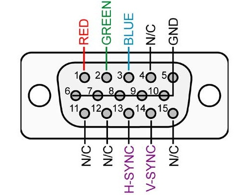
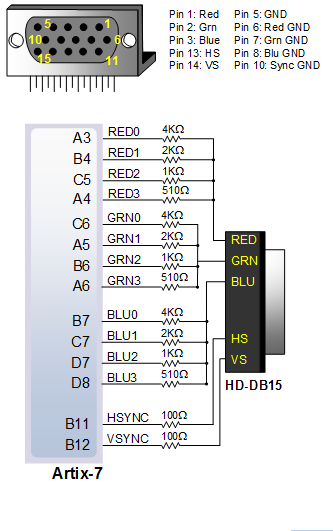
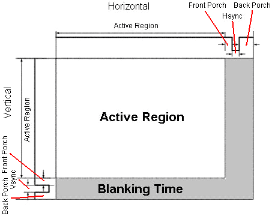
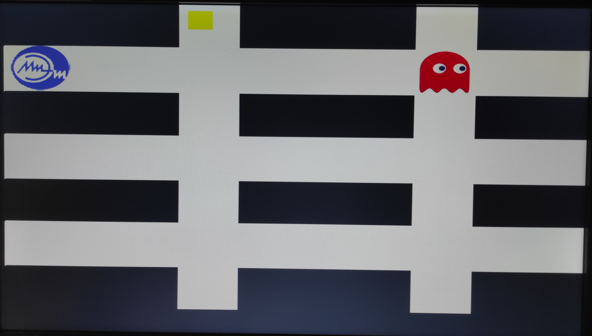
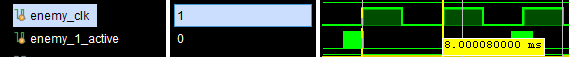

# Игра на ПЛИС

- [Теория](#теория)
  - [Что такое VGA и как оно работает](#что-такое-vga-и-как-оно-работает)
  - [Реализация VGA интерфейса на ПЛИС Nexys A7](#реализация-vga-интерфейса-на-плис-nexys-a7)
  - [Генерация сигнала VGA](#генерация-сигнала-vga)
- [Процесс разработки](#процесс-разработки)
  - [Список необходимых модулей](#список-необходимых-модулей)
  - [Описание модуля demo](#описание-модуля-demo)

## Теория

Для FPGA существует определённая кривая обучаемости, потому что здесь вы разрабатываете схемы, а не пишете программное обеспечение, которое работает на процессоре. Но если вы с помощью FPGA можете заставить мигать пять светодиодов, то в целом готовы реализовать выдачу видеосигнала VGA. Формат видео VGA намного проще, чем вы думаете: всего три сигнала для пикселей (красный, зелёный и синий) и два сигнала для горизонтальной и вертикальной синхронизации.

## Что такое VGA и как оно работает

VGA (Video Graphics Array) является стандартом для аналоговой передачи видеосигнала на компьютерных мониторах. Этот стандарт был разработан компанией IBM в 1987 году и быстро стал популярным в мире компьютеров.

Работа VGA основана на передаче аналоговых сигналов для создания изображения на мониторе. Например, в компьютере формированием изображения занимается графическое ядро в центральном процессоре или дискретная видеокарта, генерирующие так называемые RGB-сигналы, которые представляют отдельные пиксели изображения. Каждый RGB-сигнал представлен отдельным аналоговым сигналом, который определяет яркость цвета для каждого пикселя изображения.

VGA-кабель передает RGB-сигналы от видеокарты к монитору. Кабель содержит несколько проводников для каждого цвета (красный, зеленый и синий), а также провод для горизонтальной и вертикальной синхронизации. Приемник на мониторе преобразует эти сигналы обратно в видеоизображение.



## Реализация VGA интерфейса на ПЛИС Nexys A7

Согласно [документации](https://digilent.com/reference/_media/reference/programmable-logic/nexys-a7/nexys-a7_rm.pdf) на ПЛИС Nexys-A7, к разъему [DE-15](https://ru.wikipedia.org/wiki/D-sub) (настоящее имя разъема к которому подключается провод от монитора, а VGA - лишь название графического интерфейса) к каждому из контактов, отвечающих за цвет, подходят по 4 сигнала, подключенных черех резисторы, тем самым позволяя реализовать различную яркость для каждого из цветов.



## Генерация сигнала VGA

Основная идея в том, чтобы использовать два счётчика: один для пикселей по горизонтали, а второй для горизонтальных линий. В каждой точке экрана по этим координатам генерируется нужный цвет пикселя. Кроме того, генерируются импульсы горизонтальной и вертикальной синхронизации, когда счётчики находятся в соответствующей позиции. Для реализации будем использовать базовое разрешение VGA 640x480@60Hz, где нужно вести отсчёт до 800 и 525. По горизонтали в каждой линии 800 пикселей: 640 видимых, 16 пустых, 96 на горизонтальную синхронизацию и ещё 48 пустых пикселей. (Такие странные параметры используются по историческим причинам). Между тем, вертикальный счётчик должен отсчитывать 525 линий: 480 линий изображения, 10 пустых, 2 линии вертикальной синхронизации и ещё 33 пустые.



## Процесс разработки

Выбор формата изображения VGA 640x480@60Hz обуславливается несколькими причинами: во-первых, на небольшом изображении проще контролировать ситуацию. Во-вторых, так как вывод изображения будет реализован посредством ПЛИС Nexys-A7 с внутренней частотой 100MHz, согласно [таймингам](http://tinyvga.com/vga-timing) для формирования сигналов, содержащих цвета пикселей, проще всего будет реализовать делитель частоты на 25MHz, что соответствует даному формату.

При создании проекта в САПР Vivado необходимо добавить файл [nexys_a7_100t.xdc](xdc/nexys_a7_100t.xdc) в Constraints проекта. В нем указаны использующиеся выводы ПЛИС и их название, которое будет фигурировать в исходниках проекта.

В качестве примера будет описан ход разработки игры подобия PacMan, в которой необходимо собирать монеты, управляя персонажем кнопками на плате, мешать этому процессу будет заскриптованный враг, попавшись которому игра будет окончена.

В оригинальной версии игры карта, где передвигается игрок, имеет вид лабиринта, в данном примере карта будет упрощена до сетки, по линиям которой необходимо будет двигаться, без возможности выхода за границы.

## Список необходимых модулей

[game_unit](src/game_unit.sv) - топ-модуль, подключающий между собой другие модули. На вход получает формируемый ПЛИС синхроимпульс частотой 100МГц, сигналы с кнопок и переключателей на плате, также выдает сигналы на светодиоды.

[sys_clk_rst_gen](src/sys_clk_rst_gen.sv) - делитель частоты, настроенный на понижение частоты до 25МГц, также формирует сигнал сброса с активной единицей, синхронизированный с выходной частотой.

[vga_controller](src/vga_controller.v) - модуль, формирующий сигналы вертикальной и горизонтальной синхронизации для вывода изображения заданных параметров и счетчики-координаты пикселя, отрисовывающегося в данный момент. На вход получает сигнал `clk` с делителя частоты и сигнал сброса.

[rom](src/rom.sv) - память на 64*64 ячейки, доступная только для чтения. Инициализированная `.mem` файлом, который содержит информацию каждого цвета `RGB` преобразованной картинки.

[demo](src/demo.v) - модуль, реализующий движение персонажей, отрисовку лабиринта, персонажей и монеты.

## Описание модуля demo

<details>

  <summary>Получившийся дизайн игры</summary>

  

</details>

Все необходимое для отрисовки изображения формуриуется в модулях, представленных [выше](#список-необходимых-модулей), кроме обозначения цвета для конкретного пикселя. Этим и еще несколькими неменее важными вещами занимается данный модуль.

Входы и выходы модуля достсточно подробно описаны, поэтому разберем логику формирования выходных сигналов проходя по всему по порядку.

```Verilog
//// 	labirint //////////////////////////////////////////////////////////
always @(posedge vga_clk or negedge arst_n) begin
  if ( !arst_n ) begin
    out_background <= 0;
  end
  else begin
    if ((col[7:0] < 190) && (row[6:0] < 62) || (row > 128 * 3 + 61))
      out_background = 12'h0;
    else
      out_background = ~SW[11:0];
  end
end
```
Здесь происходит формирование лабиринту путем сравнивания 8-ми младших бит счетчика колонок и 7-ми бит строк, где в таком случае у счетчика колонок максимальное число будет 255, у строк - 127, в результате получаем отрисовку черным цветом каждые 190 колонок и 62 строк, остальное количество пикселей - цветом, выставленным на переключателях платы. Третьим выражением отсечена лишняя нижняя часть лабиринта.

Меняя положения 12-ти переключателей на плате меняется цвет дороги лабиринта.

```Verilog
always @(posedge enemy_clk or negedge arst_n) begin
  if ( !arst_n ) begin
    stick_border_hl_c <= 8; 
    stick_border_hl_r <= 63;
    move_c <= 0;
    move_r <= 0;
  end 
  else 
  if(!you_lose)
  begin
    if ( ( stick_border_hl_r[6:0] < 67 ) && ( stick_border_hl_r[6:0] >= 60 ) ) begin
      move_c <= 1;
    end else begin
      move_c <= 0;
    end
    if ( ( stick_border_hl_c[7:0] >= 188 ) && ( stick_border_hl_c[7:0] < 195 ) ) begin
      move_r <= 1;
    end else begin
      move_r <= 0;
    end
    if ((move_r || move_c)  ) begin
      if ( (BTNL) && (stick_border_hl_c != 0  ) && move_c) begin
        stick_border_hl_c <= stick_border_hl_c - 1; 
      end
      else if ( (BTNR) && (stick_border_hl_c != 639-stick_width) && move_c ) begin
        stick_border_hl_c <= stick_border_hl_c + 1; 
      end
      if      ( (BTND) && (stick_border_hl_r != 479-stick_height) && move_r && (stick_border_hl_r < 128 * 3)) begin
        stick_border_hl_r <= stick_border_hl_r + 1; 
      end
      else if ( (BTNU) && (stick_border_hl_r != 0  ) && move_r ) begin
        stick_border_hl_r <= stick_border_hl_r - 1; 
      end
    end else begin //move err
      stick_border_hl_r <= stick_border_hl_r - 1;
      stick_border_hl_c <= stick_border_hl_c - 1;
    end
  end
end
```

Данная логика реализует движение игрока в зависимости от нажатой кнопки. Ограничение движения по лабиринту (запрет прохождения через стены) реализован с помощью подобного отрисовки лабиринта алгоритму - сравнение младших бит координаты игрока с константными значениями.

```Verilog
always @ ( posedge vga_clk or negedge arst_n) begin 
  if ( !arst_n ) begin
    enemy_clk <='b0;
    enemy_clk_count <= 32'b0;
  end
  else  begin
    if(enemy_clk_count < 32'd100000)
      enemy_clk_count <= enemy_clk_count + 1'b1;
    else begin
      enemy_clk_count <= 0;
      enemy_clk <= ~enemy_clk;
    end
  end
end 
```
Данная логика реализует делитель частоты, который используется для движения игрока и врага, потому как бегать от врага, который движется со скоростью 25МГц довольно сложно. Меняя константу в сравнении можно увеличивать или уменьшать скорость персонажей.

Текущая реализация формирует сигнал с периодом 8ms - 125Гц, это значит персонажи двигаются со скоростью 125 микселей в секунду.



